<div align="center">

<!-- HEADER CON ANIMACIÓN -->


<!-- TYPING EFFECT -->


<br/>

<!-- PROFILE BADGES -->
<p align="center">
  
  
  
  
</p>

</div>

---

<br/>

## 👨‍💻 Sobre mí 


```javascript
const chuchoFlores = {
    titulo: "Ingeniero en Sistemas Informáticos",
    ubicacion: "Cochabamba, Bolivia 🇧🇴",
    
    especializacion: [
        "Cybersecurity",
        "Ethical Hacking", 
        "Penetration Testing",
        "DevSecOps"
    ],
    
    enfoque_actual: "Construyendo sistemas seguros y resilientes",
    
    disponibilidad: "Abierto a oportunidades de colaboración",
    
    lema: "La seguridad no es un producto, es un proceso"
};
```

<br clear="right"/>

### 🎯 Áreas de Expertise

<table>
<tr>
  <td align="center" width="25%">
    
    <br><b>Linux Administration</b>
    <br><sub>Hardening & Scripting</sub>
  </td>
  <td align="center" width="25%">
    
    <br><b>Penetration Testing</b>
    <br><sub>Web, Network & API</sub>
  </td>
  <td align="center" width="25%">
    
    <br><b>DevSecOps</b>
    <br><sub>CI/CD Security</sub>
  </td>
  <td align="center" width="25%">
    
    <br><b>Security Automation</b>
    <br><sub>Tools Development</sub>
  </td>
</tr>
</table>

<br/>

---

## 🛠️ Tecnologías Conocidas

<div align="center">

### 💻 Lenguajes de Programación

<p>
  
  &nbsp;
  
  &nbsp;
  
  &nbsp;
  
  &nbsp;
  
  &nbsp;
  
  &nbsp;
  
  &nbsp;
  
</p>

### 🎨 Frontend Development

<p>
  
  &nbsp;
  
  &nbsp;
  
  &nbsp;
  
  &nbsp;
  
  &nbsp;
  
</p>

### 🗄️ Bases de Datos

<p>
  
  &nbsp;
  
  &nbsp;
  
  &nbsp;
  
  &nbsp;
  
  &nbsp;
  
</p>

### 🐧 Sistemas Operativos & Plataformas

<p>
  
  &nbsp;
  
  &nbsp;
  
  &nbsp;
  
  &nbsp;
  
  &nbsp;
  
</p>

### ☁️ Cloud & DevOps

<p>
  
  &nbsp;
  
  &nbsp;
  
  &nbsp;
  
  &nbsp;
  
  &nbsp;
  
  &nbsp;
  
  &nbsp;
  
</p>

### 🛡️ Security Tools & Frameworks

<p>
  
  &nbsp;
  
</p>

### 🎨 Diseño & Herramientas

<p>
  
  &nbsp;
  
  &nbsp;
  
  &nbsp;
  
  &nbsp;
  
  &nbsp;
  
</p>

</div>

<br/>

---

## 📊 Estadísticas de GitHub

<div align="center">
  


</div>

<br/>

<div align="center">
  
### 🏆 Trofeos de GitHub


</div>

<br/>

---

## 🎓 Certificaciones & Logros

<div align="center">

### 📜 Certificaciones Profesionales

| 🏅 Certificación | 🏢 Emisor | 📊 Estado | 📅 Año |
|:---|:---:|:---:|:---:|
| **Certified Ethical Hacker (CEH)** | EC-Council | 🔄 En Progreso | 2025 |
| **CompTIA Security+** | CompTIA | 🔄 En Progreso | 2025 |
| **Linux Professional Institute Certification** | LPI | ✅ Certificado | 2024 |
| **AWS Certified Security - Specialty** | Amazon Web Services | 🎯 Planeado | 2025 |
| **OSCP - Offensive Security** | Offensive Security | 🎯 Planeado | 2026 |
| **Certified Information Systems Security** | ISC² | 🎯 Planeado | 2026 |

<br/>

### 🏆 Logros en Plataformas

<table>
<tr>
<td align="center">

<br/><b>TryHackMe</b>
<br/><sub>Top 10% Global</sub>
</td>
<td align="center">

<br/><b>HackTheBox</b>
<br/><sub>Hacker Rank</sub>
</td>
<td align="center">

<br/><b>CTF Competitions</b>
<br/><sub>15+ Victories</sub>
</td>
</tr>
</table>

</div>

<br/>

---

## 💼 Proyectos Destacados

<div align="center">

<table>
<tr>
<td width="50%" valign="top">

### 🔐 SecureAuth Framework
**Multi-Factor Authentication System**


Sistema robusto de autenticación con MFA, detección de anomalías y protección contra ataques comunes.

[🔗 Ver Proyecto](https://github.com/ChuchoFlores/SecureAuth)

</td>
<td width="50%" valign="top">

### 🛡️ VulnScanner Pro
**Automated Vulnerability Scanner**


Escáner automatizado de vulnerabilidades con reportes detallados y recomendaciones de remediación.

[🔗 Ver Proyecto](https://github.com/ChuchoFlores/VulnScanner)

</td>
</tr>

<tr>
<td width="50%" valign="top">

### 🔍 Network Monitor
**Real-Time Network Monitoring**


Monitoreo de tráfico de red en tiempo real con detección de amenazas y visualización de datos.

[🔗 Ver Proyecto](https://github.com/ChuchoFlores/NetworkMonitor)

</td>
<td width="50%" valign="top">

### 🐳 SecureCI Pipeline
**DevSecOps Pipeline**


Pipeline CI/CD con análisis de seguridad integrado, escaneo de dependencias y contenedores.

[🔗 Ver Proyecto](https://github.com/ChuchoFlores/SecureCI)

</td>
</tr>
</table>

</div>

<br/>

---

## 🌐 Conecta Conmigo

<div align="center">

### 📱 Redes Sociales

<a href="https://youtube.com/@ChuchoFlores" target="_blank">
  
</a>
<a href="https://tiktok.com/@ChuchoFlores" target="_blank">
  
</a>
<a href="https://linkedin.com/in/chucho-flores" target="_blank">
  
</a>
<a href="https://facebook.com/ChuchoFlores" target="_blank">
  
</a>
<a href="mailto:chucho.flores@gmail.com">
  
</a>

### 🔐 Plataformas de Seguridad

<a href="https://tryhackme.com/p/ChuchoFlores" target="_blank">
  
</a>
<a href="https://app.hackthebox.com/profile/ChuchoFlores" target="_blank">
  
</a>
<a href="https://www.vulnhub.com/author/chucho-flores" target="_blank">
  
</a>
<a href="https://www.root-me.org/ChuchoFlores" target="_blank">
  
</a>

### 📝 Contenido & Comunidad

<a href="https://dev.to/chuchoflores" target="_blank">
  
</a>
<a href="https://medium.com/@chuchoflores" target="_blank">
  
</a>
<a href="https://twitter.com/ChuchoFloresSec" target="_blank">
  
</a>
<a href="https://instagram.com/chucho.sec" target="_blank">
  
</a>

</div>

<br/>

---

## 📈 Actividad de Contribución

<div align="center">
  


</div>

<br/>

---

## 💡 Frase Motivacional

<div align="center">


</div>

<br/>

---

## 🎯 Enfoque Actual 2025

```mermaid
mindmap
  root((Chucho Flores<br/>2025))
    Certificaciones
      CEH
      Security+
      OSCP
    Tecnologías
      Cloud Security
      Kubernetes
      AI Security
    Proyectos
      Tools Development
      Open Source
      Security Research
    Comunidad
      Blog Posts
      CTF Participation
      Mentorship
```

<div align="center">



**📚 Actualmente aprendiendo:**
- Advanced Penetration Testing
- Cloud Security (AWS & Azure)
- Security Automation with Python
- Container Security & Kubernetes

</div>

<br/>

---

## 💖 Apoya mi Trabajo

<div align="center">

Si encuentras útiles mis proyectos o disfrutas mi contenido, considera apoyar mi trabajo ☕

<a href="https://www.buymeacoffee.com/chuchoflores" target="_blank">
  
</a>

</div>

<br/>

---

<div align="center">

### ⚡ Datos Curiosos

- 🔐 Apasionado por la seguridad informática desde 2018
- 🐧 Usuario de Linux desde hace más de 6 años
- ☕ Impulsado por café y código
- 🎯 Siempre aprendiendo nuevas técnicas de hacking ético
- 📚 Creo firmemente en el aprendizaje continuo
- 🌟 "La seguridad no es un producto, es un proceso"

</div>

---

<div align="center">

### 💼 Abierto a Oportunidades

**Actualmente disponible para:**
- 🔐 Consultoría en Ciberseguridad
- 🛡️ Proyectos de Pentesting
- ☁️ Arquitectura de Seguridad en la Nube
- 👥 Colaboración en Herramientas de Seguridad
- 📝 Escritura Técnica y Charlas

**¡Conectemos y construyamos algo seguro juntos!**

📧 **Contacto:** chucho.flores@gmail.com

</div>

---

<div align="center">


**⭐ Dale estrella a mis repositorios si los encuentras útiles ⭐**

<sub>Última actualización: Febrero 2025 | Hecho con 💙 y mucho ☕</sub>

<br/>


</div>

---

<!--
**ChuchoFlores/ChuchoFlores** is a ✨ _special_ ✨ repository because its `README.md` (this file) appears on your GitHub profile.
-->
